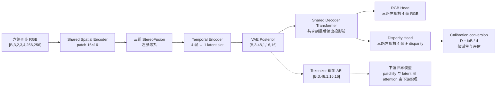

# Stereo Tokenizer Plan

# Stereo OmniTokenizer 设计文档

## 1\. 项目目标

基于 OmniTokenizer 的 VAE 结构和训练框架，从随机初始化开始训练 Stereo VAE。模型接收三个安装视角的左右 RGB 视频，以每组双目的左相机为参考，重建左视角 RGB 并预测正 disparity。Metric depth 不使用独立神经网络 Head，而是由预测 disparity 和每条样本的相机标定参数计算得到。

FoundationStereo 仅用于离线生成训练所需的 disparity GT 和置信度信息，不进入模型训练图之外的推理 pipeline，也不作为模型推理时的依赖。

### 1\.1 Tokenizer 输入输出 Pipeline



主链路输出左参考系 RGB 和 disparity。Depth 不设置神经网络 Head，也不参与训练 Loss；只在评估时由预测或 GT disparity 与对应标定参数即时计算。虚线支路只定义 latent 交给下游世界模型的 ABI；Stereo OmniTokenizer 不实现下游 DiT/Transformer 的 patchify、unpatchify 或 latent slots 之间的 attention。

## 2\. 最终模型配置

|参数|第一版设定|
|---|---|
|输入视角|Head、Left wrist、Right wrist|
|每个视角输入|Left RGB、Right RGB|
|输入分辨率|256×256|
|当前训练 sample|连续同步 4 帧，无 anchor|
|模式边界|原 `OmniTokenizer` 主类直接改为 Stereo-only；不保留 legacy image-mode，也不维护旁路 `StereoTokenizer` 实现|
|源视频与采样|源视频约 30 FPS；训练帧间隔 0.1 秒（等效 10 FPS）|
|Sample stride|0.4 秒，4 帧半开窗口不重叠|
|OmniTokenizer spatial patch size|16×16 pixels|
|OmniTokenizer spatial grid|16×16 latent positions|
|Temporal patch size|4|
|Embedding dimension|512|
|Spatial Transformer depth|4|
|Spatial Encoder block|`ttww`|
|Spatial Decoder block|`tttt`|
|Window Attention size|8×8 tokens|
|Spatial positional encoding|RoPE|
|Temporal Transformer depth|4|
|Attention heads|8|
|Head dimension|64|
|VAE latent channels|48\(LingBot\-VA\)|
|RGB 输出|3 通道|
|Disparity 输出|1 通道|
|Depth 输出|由 disparity 和标定参数派生|
|下游 Cross\-view Attention|不属于 Tokenizer，由下游世界模型决定|
|训练精度|BF16|
|初始化|全部从零训练；RGB Head 沿用 OmniTokenizer 的结构与初始化规则但不加载预训练权重，Disparity weight 随机、bias 由 train split 扫描冻结|
|Global batch size|8|
|训练周期|10 epochs|
|Validation|有独立 validation Manifest 时，每个 epoch 结束后运行 1 次完整 validation；当前 `pilot_train` 不伪造 validation|
|Checkpoint|每个 epoch 保存一次|

Spatial Encoder 的 `t` 表示全局 Spatial Attention，`w` 表示 Window Attention。因此 `ttww` 表示前两层使用全局 Attention，后两层使用 8×8 Window Attention。Window Attention 运行在 16×16 OmniTokenizer 网格上，每帧划分为 2×2 个窗口。Spatial Decoder 使用四层全局 Attention。

## 3\. 网络架构与张量流

### 3\.1 输入定义

每个 sample 包含三个同步安装视角，每个视角包含一组左右双目：

- View 0：Head Left / Head Right；

- View 1：Left\-wrist Left / Left\-wrist Right；

- View 2：Right\-wrist Left / Right\-wrist Right。

六路图像不在像素空间拼接。输入保留显式的 View 和 Eye 维度，一次传入模型：

$X\in\mathbb{R}^{B\times3\times2\times3\times4\times256\times256}$

其中，三个连续的维度 `3×2×3` 分别表示 View、Eye 和 RGB channel。

### 3\.2 Shared Spatial Encoder

将 View、Eye 和 Time 合并到 batch，六路图像使用同一组 Spatial Encoder 参数批量提取特征：

$[B,3,2,3,4,256,256]
\rightarrow
[B\times3\times2\times4,3,256,256]$

OmniTokenizer spatial patch size 为 16，因此每张图像得到 16×16 个 spatial tokens。每个 token 对应一个 16×16 像素区域：

$[B\times3\times2\times4,3,256,256]
\rightarrow
[B\times3\times2\times4,512,16,16]$

恢复显式维度后为：

$[B,3,2,4,512,16,16]$

这里已经完成 OmniTokenizer 的空间压缩。下游 DiT 的 `(1,2,2)` patchify 不属于 Shared Spatial Encoder，不在此处执行。左右相机共享 Spatial Encoder 参数不等于只计算一次。六路输入仍分别经过编码器，只是使用同一组权重。

### 3\.3 StereoFusion

StereoFusion 在同一视角、同一时刻内融合左右特征：

$\text{Head Left} + \text{Head Right}
\rightarrow
\text{Head stereo feature}$

$\text{Left-wrist Left} + \text{Left-wrist Right}
\rightarrow
\text{Left-wrist stereo feature}$

$\text{Right-wrist Left} + \text{Right-wrist Right}
\rightarrow
\text{Right-wrist stereo feature}$

融合结果以各组双目的左相机为参考：

$[B,3,2,4,512,16,16]
\rightarrow
[B,3,4,512,16,16]$

右特征在 StereoFusion 后丢弃，不允许通过 skip connection 绕过 VAE bottleneck 直接进入 Decoder。

三个视角复用同一套 StereoFusion 参数。实际搜索 mask 按视角分别构造，允许 Head、Left-wrist、Right-wrist 使用不同的已解析搜索范围 $w_v$；权重共享不等于三个视角使用相同 mask。

### 3\.4 Temporal Encoder

StereoFusion 后，三个视角分别进行时间压缩和 Temporal Transformer，不进行跨视角融合。时间压缩必须发生在 StereoFusion 之后。当前训练主链路使用连续 4 帧且不保留 anchor，先在每个空间位置将 4 帧特征拼接，再沿用 OmniTokenizer temporal patch projection 的线性投影方式完成 `4×512→512`：

$[B,3,4,512,16,16]
\rightarrow
[B,3,1,512,16,16]$

投影前后均使用与 OmniTokenizer patch embedding 对齐的归一化层。随后保留原 temporal Transformer，其输入 temporal length 已经是 1，因此它不在 4 个 raw frames 之间执行 self-attention。4 帧内部只有上述联合线性投影；不同 latent slots 之间的 temporal attention 由下游世界模型实现。

主 `OmniTokenizer` 第一版严格要求结构化 $T=4$，不实现 anchor、单帧或 legacy image-mode；Stereo 能力直接进入原 Encoder、Decoder 和训练主类，不保留旁路 tokenizer。

### 3\.5 VAE Posterior

Posterior Head 分别预测 48 通道 $\mu$ 和 48 通道 $\log\sigma^2$，通过重参数化得到与 LingBot\-VA 接口对齐的 48 通道 latent：

$Z\in\mathbb{R}^{B\times3\times48\times1\times16\times16}$

这里的 16×16 是最终 VAE latent grid，不是下游 DiT token grid。

训练 forward 从 posterior 采样 $z=\mu+\sigma\epsilon$；validation、推理和 checkpoint 一致性测试固定使用 posterior mean $\mu$。Tokenizer 对外输出 raw latent，不在模型内部应用下游专用的 scale、mean 或 std normalization；若下游需要 normalization，必须基于冻结训练数据统计另行定义并版本化。

三个视角保留独立的 latent 槽位：

```Plain Text
Z
├── Z_head
├── Z_left_wrist
└── Z_right_wrist
```

### 3\.6 Shared Decoder

解码时将三个视角合并到 batch，使用共享 Decoder 并行恢复：

$[B,3,48,1,16,16]
\rightarrow
[B\times3,48,1,16,16]$

Shared Decoder Transformer 将三个视角作为 batch 并行处理，所有主干参数共享。Decoder 保留原 temporal Transformer 和 Spatial Transformer；temporal Transformer 接收长度为 1 的 latent sequence。输出仍为一个 temporal latent slot：

$[B\times3,512,1,16,16]$


仅最后的 spatiotemporal pixel projection 分为两个独立 Head。当前链路没有 anchor，也不把唯一 slot 当成 legacy first-frame slot；两个 Head 都直接将这个 slot 展开为完整 4 帧：

$\text{RGB Head}:
\operatorname{Linear}(512,3\times4\times16\times16=3072)
\rightarrow[B,3,3,4,256,256]$

$\text{Disparity Head}:
\operatorname{Linear}(512,1\times4\times16\times16=1024)
\rightarrow\operatorname{softplus}(d_{\mathrm{raw}})+\epsilon
\rightarrow\times s_{\mathrm{disp}}
\rightarrow[B,3,1,4,256,256]$


RGB 和 disparity 共享 Decoder Transformer，但不拼成统一 4\-channel 输出，分开的原因如下：

1. 直接复用成熟 RGB Head；

2. Disparity Head 可使用独立初始化，并可在后续 ablation 中单独替换为 MLP、卷积细化或残差结构，而不扰动 RGB 路径。

3. 两者值域、统计分布和输出约束不同，分 Head 能避免把 RGB normalization 强加给 disparity

4. 便于分别监控梯度、定位几何分支失败并做仅改变 Disparity Head 的公平 ablation。


Disparity Head 的 bias 不在扫描数据前写死。完成 train split disparity 统计后，根据最终 normalization scale 和典型 disparity 初始化，使初始 `softplus+bias` 输出处于训练分布的合理位置；RGB Head 继续沿用 OmniTokenizer 的结构与初始化规则。Shared Decoder 不执行下游 DiT 的 patchify 或 unpatchify。

每个视角均输出对应左相机参考系下的 RGB 和 disparity：

```Plain Text
Head        → Head-left RGB + disparity
Left wrist  → Left-wrist-left RGB + disparity
Right wrist → Right-wrist-left RGB + disparity
```

### 3\.7 Stereo OmniTokenizer 编解码完整数据流

```Plain Text
[B,3,2,3,4,256,256]
→ Shared Spatial Encoder
→ [B,3,2,4,512,16,16]
→ StereoFusion
→ [B,3,4,512,16,16]
→ Temporal Encoder
→ [B,3,1,512,16,16]
→ VAE Posterior
→ [B,3,48,1,16,16]
→ Shared Decoder
├→ RGB Head       [B,3,3,4,256,256]
└→ Disparity Head [B,3,1,4,256,256]
→ Calibration conversion
→ Depth            [B,3,1,4,256,256]（仅派生/评估）
```

### 3\.8 Tokenizer 输出 ABI 与下游责任边界

Stereo OmniTokenizer 的输出接口冻结为：

$Z\in\mathbb{R}^{B\times3\times48\times1\times16\times16}$


下游世界模型可以参考 LingBot\-VA 对该 VAE latent 使用 `(1,2,2)` patchify。以下内容只用于说明接口兼容关系，不属于本仓库 Stereo OmniTokenizer 的实现、配置或验收范围：

$[B,3,48,1,16,16]
\rightarrow
[B,3,1,8,8,192]
\rightarrow
[B,3,1,8,8,d_{\mathrm{DiT}}]$


其中：

$192=C_z\times p_t\times p_h\times p_w
=48\times1\times2\times2$


具体排列与投影合同为：

```Plain Text
B, V, C_z, (T·1), (H·2), (W·2)
→ B, V, T, H, W, (C_z·1·2·2)
→ Linear(192, d_DiT)
```


如果下游第一版关闭 Cross\-view Attention，可以将 View 合并到 batch，而不是把三个视角拼入同一条 self\-attention sequence：

$[B,3,1,8,8,d_{\mathrm{DiT}}]
\rightarrow
[B\times3,64,d_{\mathrm{DiT}}]$


每个下游 DiT token 覆盖 2×2 个 VAE latent，对应输入图像上约 32×32 像素。对于三个视角、1 个 temporal latent slot，Cross\-view Attention 关闭时共有三条独立的 64\-token sequence，而不是一条 192\-token sequence。Stereo OmniTokenizer 只负责输出 `[B,3,48,1,16,16]`，不提供上述 patchify、投影或 attention 模块。

## 4\. StereoFusion

### 4\.1 输入成立条件

输入左右图必须预先完成 stereo rectification，使同一物理点在左右图中位于同一 token row。StereoFusion 对每个视角、每个时刻独立执行，完成后才进入 Temporal Encoder。

对左 token $F_L(t,y,x)$，只收集右特征：

$F_R(t,y,x-\delta),\qquad \delta\in[0,w]$

越过图像边界的候选由 Attention mask 排除。标准 rectification 下，正视差通常满足：

$x_R=x_L-d$

### 4\.2 水平 Cross\-Attention

左特征生成 Query，右侧水平候选生成 Key 和 Value。每个 Attention head 只在水平候选窗口内计算：

$a_\delta
=
\operatorname{softmax}_\delta
\left(
\frac{q^Tk_\delta}{\sqrt{d_h}}
+b_\delta+M_\delta
\right)$

其中：

- $b_\delta$ 是可学习的 disparity\-offset bias；

- $M_\delta$ 是越界候选 mask；

- $d_h=64$ 是单个 Attention head 的维度。

匹配到的右目特征为：

$F_{\mathrm{match}}
=
\sum_\delta a_\delta v_\delta$

### 4\.3 Attention sharpness 与残差融合（门控）

根据 Attention entropy 定义匹配 sharpness。对位置 $(v,y,x)$，令 $K_{\mathrm{valid}}(v,x)$ 为同时满足该视角搜索范围和图像边界的有效候选数，只在有效候选上计算：

$c
=
\begin{cases}
1-\dfrac{H(a)}{\log K_{\mathrm{valid}}}, & K_{\mathrm{valid}}>1\\
1, & K_{\mathrm{valid}}=1
\end{cases}$

纹理重复、遮挡或无法可靠匹配的区域通常具有更均匀的 Attention 分布，因此 sharpness 更低。该量是模型内部 attention 分布的尖锐程度，不表述为经过标定的概率置信度。边界位置不能固定使用 $\log(w+1)$，否则无效候选会造成系统性偏差；$K_{\mathrm{valid}}=1$ 时按上式显式定义，避免除以 $\log1=0$。

融合结果为：

$\Delta F_L=W_oF_{\mathrm{match}}$

$F_{\mathrm{fused}}
=
F_L+\alpha c\Delta F_L$

第一版明确采用以下初始化：

- 输出投影 $W_o$ 使用正常随机初始化；

- 可学习 gate $\alpha$ 初始化为 0。

因此训练开始时 StereoFusion 近似左目直通，之后再逐渐学习右目贡献。本文不再采用“$\alpha$ 或输出 projection 零初始化”的不确定表述。用于 gate 的 sharpness $c$ 在乘入残差前执行 `detach`；Attention 仍通过匹配特征路径学习，但不能仅通过主动压低 entropy 来放大 gate。

### 4\.4 搜索范围

StereoFusion 运行在宽度为 16 的 OmniTokenizer feature grid 上，因此 token\-space 搜索范围必须满足：

$0\le w\le15$


第一版三个视角共享同一个结构容量上限：

$w_{\max}=15,\qquad K_{\max}=w_{\max}+1=16$


每个 StereoFusion 水平 token offset 对应约 16 个输入像素。若 rectification 后某个视角 $v$ 的训练数据需要覆盖的最大像素视差为 $d_{\max,v}^{\mathrm{pixel}}$，该视角运行 mask 按下式换算：

$w_v
=
\min\left(15,\left\lceil\frac{d_{\max,v}^{\mathrm{pixel}}}{16}\right\rceil\right)$

当前 100 MCAP 工程 pilot 冻结 `w_v=(7,7,7)`，三个视角均使用 offsets `[0,1,2,3,4,5,6,7]`，即 `K=8`。权重仍只共享一套，三个视角分别构造边界 valid mask；这里三个数据范围恰好相同，不改变“分视角 mask”的实现合同。

## 5\. 输出与几何转换

### 5\.1 正 Disparity

模型先预测 normalized disparity，并通过 `softplus` 保证为正：

$\tilde d
=
\operatorname{softplus}(d_{\mathrm{raw}})+\epsilon$


根据 train split 扫描冻结的 normalization scale $s_{\mathrm{disp}}$ 恢复 256×256 输出坐标中的 pixel disparity：

$\hat d=s_{\mathrm{disp}}\tilde d$


$\epsilon$ 用于防止 disparity 为 0，避免后续计算 depth 时发生除零。若扫描后决定不做额外 normalization，则显式设置 $s_{\mathrm{disp}}=1$；不能省略该 resolved\-config 字段。

### 5\.2 Metric Depth

模型不设置独立 Depth Head。对于每条样本，根据对应左相机的投影参数和 stereo baseline，将预测 disparity 转换为 metric depth：

$\hat D
=
\frac{f_xB}{\hat d}$

其中：

- $f_x$ 是 rectified left camera 的水平焦距；

- $B$ 是该双目相机的 metric baseline；

- $\hat d$ 是以像素为单位的预测 disparity。

$f_x$、$B$ 和 disparity 必须处于相互一致的分辨率与尺度下。图像缩放到 256×256 后，必须同步更新投影矩阵或焦距，不能直接使用缩放前的 $f_x$。

### 5\.3 输出定义

模型直接输出：

$\hat I_L\in\mathbb{R}^{B\times3\times3\times4\times256\times256}$

$\hat d_L\in\mathbb{R}^{B\times3\times1\times4\times256\times256}$

由标定参数派生：

$\hat D_L\in\mathbb{R}^{B\times3\times1\times4\times256\times256}$

需要统一 RGBD 张量时，在通道维拼接 RGB 与派生 depth：

$\operatorname{concat}(\hat I_L,\hat D_L)
\in
\mathbb{R}^{B\times3\times4\times4\times256\times256}$

## 6\. 训练监督与 Loss

### 6\.1 GT 生成合同

以下流程属于训练监督合同，不绑定具体数据路径、MCAP 数量或存储规模：

```Plain Text
六路视频解码与同步
→ 每组双目立体矫正
→ FoundationStereo 生成左视角 disparity GT
→ 生成 valid/confidence mask
→ 写入训练索引或缓存
```

FoundationStereo 只负责离线生成 disparity 训练标签。训练不需要单独生成或缓存 depth GT。模型推理时只使用左右 RGB、必要的标定参数以及训练得到的 Stereo VAE；评估需要 metric depth 时，根据 disparity 和标定参数即时计算。

### 6\.2 OmniTokenizer 原有 Loss

保留与 RGB/VAE 训练有关的 OmniTokenizer Loss：

- RGB reconstruction loss；

- LPIPS；

- image/video GAN loss；

- feature matching loss；

- KL loss。

GAN 和 LPIPS 只作用于 RGB，不作用于 disparity。从零训练时使用 KL warmup；GAN 在重建稳定后按训练 gate 启用。

### 6\.3 Masked Disparity Loss

设 $M_p$ 为像素 $p$ 的有效 mask，GT normalized disparity 为 $\tilde d_p^{GT}=d_p^{GT}/s_{\mathrm{disp}}$。Masked SmoothL1 定义为：

$L_{\mathrm{disp}}
=
\frac{
\sum_pM_p\operatorname{SmoothL1}(\tilde d_p,\tilde d_p^{GT})
}{
\sum_pM_p+\epsilon
}$

该 Loss 直接监督模型的 disparity 输出。

多视角聚合时，先对每个视角分别按该视角的有效像素数归一化，再对三个视角等权平均；不能把三个视角的所有有效像素直接混合成一个全局分母。若任一视角在一个训练 batch 中完全没有有效像素，当前第一版 fail closed 并报告数据/采样问题，不静默跳过该视角。

### 6\.4 Disparity Geometry Gradient Loss

使用小权重 masked disparity gradient loss 约束物体边界和局部几何连续性：

$L_{\nabla}
=
\frac{
\sum_pM_p^{\nabla}
\left|
\frac{\nabla d_p}{s_{\nabla}}-
\frac{\nabla d_p^{GT}}{s_{\nabla}}
\right|_1
}{
\sum_pM_p^{\nabla}+\epsilon
}$

其中 $M^{\nabla}$ 要求参与差分的相邻像素均有效。Gradient Loss 使用 pixel disparity 的差分并显式除以独立的 `geometry_gradient_scale_px`；当前工程 pilot 冻结为 16 px。它不复用 disparity reconstruction 的 128 px normalization scale，也不对 depth 计算 gradient Loss。$\lambda_{\nabla}$ 保持小权重，在短 calibration run 前不写死具体数值。

Gradient Loss 同样先分别汇总每个视角的水平与垂直有效相邻像素并归一化，再对三个视角等权平均。

### 6\.5 总 Loss

总 Loss 为：

$L
=
L_{\mathrm{Omni\text{-}original}}
+\lambda_{\mathrm{disp}}L_{\mathrm{disp}}
+\lambda_{\nabla}L_{\nabla}$

所有 disparity Loss 都只在有效 mask 内计算，并使用有效元素数量归一化。训练不包含 log\-depth Loss、depth reconstruction Loss 或 depth gradient Loss。$\lambda_{\mathrm{disp}}$、$\lambda_{\nabla}$、disparity normalization scale 和 Disparity Head 初始化必须按第 8 节的数据扫描与 Loss calibration gate 冻结。

KL 保留 OmniTokenizer 的元素求和口径：每个 sample、每个视角对 `[48,1,16,16]` 的全部 latent 元素求和，得到 `[B,V]`，再对 $B\times V$ 取平均。KL 不按 latent 元素数求均值，其最终 warmup 和权重必须按这一口径 calibration。

### 6\.6 第一版训练 Batch 与确定性 Core Loss 合同

训练核心最少接收：

```Plain Text
video       [B,3,E,3,4,256,256]  RGB，范围由 preprocessing resolved config 冻结
disparity   [B,3,1,4,256,256]    最终 256×256 坐标中的 pixel disparity
valid_mask  [B,3,1,4,256,256]    bool
```

A 使用 `E=1` 或在 `E=2` 输入中只读取左目；B 使用 `E=2`；C 只在评估时把右目替换为左目，不作为训练 mode。训练核心根据 checkpoint/resolved config 中逐视角保存的 $s_{\mathrm{disp},v}$ 将 pixel disparity GT 转为 normalized reconstruction target；gradient 分支直接使用 pixel disparity 并除以独立的 `geometry_gradient_scale_px`。

确定性 core loss 只组合 RGB reconstruction、masked disparity、masked disparity gradient 和 KL。LPIPS、image/video GAN 与 feature matching 作为显式的训练阶段项保留在 core loss 之外，其启用 gate 和权重在 Pilot 冻结前不得通过隐藏默认值生效。

## 7\. 实验设计

### 7\.1 实验总览

|实验|是否训练|输入|StereoFusion|用途|
|---|---|---|---|---|
|A：Monocular baseline|是|三个视角的左 RGB|否|测量无右图时的单目重建与深度能力|
|B：Stereo OmniTokenizer|是|三个视角的正确左右 RGB|是|测量完整双目方案的收益|
|C：B\-SameRGB|否|将 B 的右输入替换为对应左 RGB|使用 B 原模块|验证 B 是否真正依赖双目视差|

### 7\.2 A

A 只输入三个视角的左 RGB，不输入右 RGB，也不使用 StereoFusion。其有效输入可表示为：

$[B,3,3,4,256,256]$

A 使用与 B 相同的输出定义、latent shape、共享 Decoder 和监督目标，用于回答：

> 在没有右图和双目视差的情况下，当前 VAE 能够通过纹理、尺度和场景先验学习到多少深度信息？
>
>

### 7\.3 B

B 输入同步且完成 rectification 的正确左右 RGB，通过 Shared Spatial Encoder 和 StereoFusion 将右图几何信息写入左参考 latent，最终输出左视角 RGB 和 disparity，并派生 metric depth。

B 用于回答：

> 在相同训练条件下，加入正确右图和 StereoFusion 后，是否比 A 获得更准确、更稳定的几何表征？
>
>

### 7\.4 C

C 不训练新模型，直接复用 B checkpoint。推理时将：

$(I_L,I_R)$

替换为：

$(I_L,I_L)$

该操作保持两路输入的场景语义、颜色和纹理接近，同时移除真实左右相机之间的视差。

如果 C 的 depth/disparity 质量相对 B 明显下降，而 RGB 重建变化较小，说明 B 确实使用了右图几何信息。如果 C 与 B 几乎没有差异，则说明模型可能主要依赖左图单目线索，或 StereoFusion 没有将右图信息有效写入 latent。

### 7\.5 公平比较条件

A 和 B 必须保持以下条件一致：

- 相同的 MCAP/轨迹级数据划分；

- 相同的训练 sample 数、epoch 数和 optimizer step 口径；

- 相同的图像分辨率和 clip 定义；

- 相同的 latent shape；

- 相同的 Decoder；

- 相同的 RGB 和 disparity 监督目标；depth 只作为派生评估量；

- 相同的 Loss 定义和权重；

- 相同的优化器、scheduler 和主要训练超参数；

- 相同的 validation/test 样本及指标实现。

A 与 B 的参数量、FLOPs、训练吞吐和推理延迟需要分别记录，不能将模型质量提升与额外计算开销混在一起判断。

## 8\. 训练前数据准备、扫描与参数冻结

正式数据的准备包含 Manifest、数据盘点、同步检查、预处理、双目矫正、FoundationStereo GT 生成、质量过滤、数据划分、统计扫描以及 Loss calibration，执行顺序固定如下。当前工程 pilot 的已完成状态和正式 split 例外单列于第 8.2 节。


```Plain Text
冻结数据与预处理合同
→ 扫描原始数据
→ 六路视频完整性与同步检查
→ resize/letterbox 与标定参数同步变换
→ stereo rectification
→ FoundationStereo 生成 disparity/confidence
→ 保存 raw confidence，执行不依赖训练统计的确定性 valid mask 与质量过滤
→ 按 episode/trajectory 划分 train/validation/test
→ 生成并冻结 Manifest
→ 只扫描 train split 计算统计量
→ 确定 confidence threshold、最终 valid mask 与其他数据相关参数
→ 短 calibration run
→ 冻结 Loss 权重与 Disparity Head 初始化
→ 输出 resolved config 和数据版本产物
```

### 8\.1 数据与 Sample 合同

当前每个 sample 使用连续同步的 4 帧，不保留 anchor：


```Plain Text
3 个安装视角
× 每个视角 Left/Right
× 4 帧
× RGB
```


输入张量为 `[B,3,2,3,4,256,256]`。当前工程 pilot 的相邻采样帧间隔为 0.1 秒，4 个时间戳的首尾差为 0.3 秒，对应半开 sample 窗口 `[t,t+0.4s)`；相邻 sample 起点间隔 0.4 秒且不重叠。训练只打乱 sample，sample 内 4 帧保持时间顺序。episode/trajectory 结尾不足 4 帧的部分直接丢弃，不补帧，也不跨边界拼接。


以下合同必须在扫描与 GT 生成前冻结：


- 最终输入分辨率和 resize/letterbox 方法；

- 数据 FPS 与抽帧规则；

- `clip_length=4`、`frame_interval_s=0.1`、`sample_stride_s=0.4`；

- 六路视频同步容差和缺帧处理；

- stereo rectification 方法和搜索方向约定；

- 标定参数缩放、padding 和坐标系变换方式；

- FoundationStereo 版本、checkpoint 和 resolved config；

- disparity、confidence、valid mask 的 dtype、单位、压缩和缓存格式；

- episode/trajectory 级 train/validation/test 划分规则；

- 质量过滤规则及 reason code。

### 8\.2 当前 100 MCAP 工程 Pilot

当前 pilot 扫描 100 个 MCAP、约 22.94 分钟，源六路视频约 30 FPS。3415 个初始候选中移除 2 个同步失败 sample 和 6 个引用不可解码帧的 sample，Manifest v2 最终包含 3407 个 `pilot_train` sample；六路最大同步误差为 12.975 ms，低于 20 ms 门限。H.264 完整性审计和缺帧后解码序号修复均已完成。

图像预处理固定为 `640×480 → resize 256×192 → top/bottom padding 32 → 256×256`，对应 `resize_size=[192,256]`（H,W）和 `padding_ltrb=[0,32,0,32]`。原始 H.264 已完成 stereo rectification，不重复应用 `R`。内参取 `camera_info.P`，baseline 为 `-P_right[0,3]/P_right[0,0]`，正 disparity 定义为 `x_left-x_right>0`。

FoundationStereo cache 已完成 3407/3407，保存 `disparity_left`、`lr_error_px`、`base_valid_mask`，其单 sample shape 均为 `[4,3,256,256]`，并保存 `fx`、`baseline_m` 和版本元数据。Batch 边界必须统一转置并增加 channel 轴为 `[B,3,1,4,256,256]`；不缓存 depth GT。

最终 mask 为：

```Plain Text
content_mask
& base_valid_mask
& isfinite(disparity)
& isfinite(lr_error_px)
& (0.5 <= disparity <= 112.0)
& (lr_error_px <= max(1.0, 0.05 * disparity))
```

不合格 disparity 直接 mask，不 clamp 后监督。当前 mask 保留全部视角 89.91% 的 base-valid 像素；Head、Left-wrist、Right-wrist 分别为 93.48%、95.96%、80.57%。训练按视角记录 valid ratio 和 loss；某个 sample-view 覆盖率较低时仍保留其 RGB 与其他视角监督，但若整个 batch 的某一视角完全没有有效像素则 fail closed。

当前已由 pilot 扫描冻结的数据参数为：`disparity_normalization_scale=128.0`、`disparity_head_bias=-2.572`、`geometry_gradient_scale_px=16.0`、`stereo_fusion_w=7`、offsets `[0..7]`、disparity 有效范围 `[0.5,112.0]`、LR threshold `max(1.0,0.05d)`。其中 bias 对应 `d=128×(softplus(raw)+eps)` 和全局有效 disparity median 9.42 px。

### 8\.3 Manifest 与数据划分

正式数据按照 90%/5%/5% 划分为 train、validation 和 test。划分必须在 episode/trajectory 或完整 MCAP 级完成，不能先生成 clips 再随机分配。当前工程 pilot 只有 `pilot_train`，smoke-32 和 overfit-128 也是固定训练子集；它们不运行或汇报 validation。训练接口仅在提供独立 validation Manifest 后，才在每个 epoch 末完整遍历一次。


每条 sample 建议至少记录：


- `sample_id`；

- `episode_id` / `trajectory_id`；

- `split`；

- 4 帧时间戳；

- 六路视频路径及帧索引；

- 三组 stereo calibration 引用；

- resize/letterbox 参数；

- resize 后的 $f_x,f_y,c_x,c_y$ 和 baseline；

- disparity GT 引用；

- confidence/valid mask 引用；

- FoundationStereo 版本与 resolved config 标识；

- 预处理版本和数据版本；

- 质量检查状态及过滤原因。


Manifest 级产物必须包含：


- train/validation/test episode 数和 sample 数；

- 被过滤 sample 数及原因分布；

- Manifest hash；

- 数据版本、预处理版本和标定版本；

- FoundationStereo 版本与配置标识。


### 8\.4 Train Split 完整数据扫描

统计只能使用冻结 Manifest 的 train split，并且 Head、Left\-wrist、Right\-wrist 三组相机分别统计：


- 原始数据数量、时长、FPS、缺帧率；

- 六路视频同步误差；

- 可形成完整 4 帧 sample 的比例；

- resize 后 $f_x$、baseline 及其分布；

- disparity 的 min、mean、std、p1、p5、p50、p95、p99、p99\.9、max；

- near\-zero、极端大 disparity 和异常值比例；

- confidence 分布；

- valid mask 覆盖率；

- 遮挡、越界和低置信度比例；

- 水平、垂直 disparity gradient 的 mean、p50、p95、p99；

- 相邻像素同时有效的 gradient\-valid ratio；

- 不同视角、场景和时间段之间的分布差异；

- resize 前后图像、disparity、$f_x$ 和 baseline 的尺度一致性。


统计产物必须保留全局汇总和分视角结果，不能只保留一个混合均值。异常 sample 应保留 `sample_id` 和过滤 reason code，便于回看原始六路视频、rectification 和 FoundationStereo 输出。


### 8\.5 由数据扫描确定的参数

以下参数不能在扫描 train split 前写死：


- disparity normalization scale $s_{\mathrm{disp}}$；

- Disparity Head 的初始 bias；

- StereoFusion 实际搜索范围 $w$；

- FoundationStereo confidence threshold；

- valid mask 规则；

- disparity 异常值过滤或裁剪范围；

- geometry gradient 的尺度参数；

- 每个 epoch 的 sample 数和 optimizer steps。


### 8\.6 Loss Calibration

数据扫描只能确定 target 尺度，不能完整确定 disparity Loss 相对 RGB、LPIPS、KL、GAN 的训练影响。统计完成后必须运行短 calibration：


- 暂不加权记录 RGB、LPIPS、KL、disparity、gradient Loss；

- 记录各 Loss 的 mean、p50、p95；

- 记录各 Loss 对 Shared Decoder、RGB Head、Disparity Head 的 gradient norm；

- 记录每个 batch 的有效 disparity 像素数量；

- 检查三个视角是否存在 Loss、有效像素或梯度严重不平衡；

- 检查 Disparity Head 初始输出是否覆盖合理数值范围且无 NaN/Inf。


完成后再冻结：


- $\lambda_{\mathrm{disp}}$；

- $\lambda_{\nabla}$；

- $s_{\mathrm{disp}}$；

- Disparity Head bias 和其他初始化参数。


$\lambda_{\nabla}$ 必须保持小权重。完成数据扫描和 calibration 前，文档及正式训练配置不写猜测性数值。


### 8\.7 数据更新后的重扫规则

任何数据变化后都必须重新生成 Manifest，并至少重新计算统计和分布漂移报告。以下变化必须重新扫描并重新运行 Loss calibration：


- 相机、baseline 或焦距变化；

- 输入分辨率或 resize/letterbox 变化；

- 新增不同任务或场景域；

- FoundationStereo 版本或 checkpoint 变化；

- confidence/valid mask 生成逻辑变化；

- disparity 或 gradient 分布明显变化；

- RGB/Disparity Head 或输出归一化方式变化。


如果只是同分布数据扩容，可以重新生成 Manifest、重算统计并与旧版本比较；在预先冻结的漂移判据内没有明显变化时，可以复用原 Loss 参数。每个训练版本必须同时保存：


- Manifest hash；

- 数据版本；

- 预处理版本；

- 标定版本；

- FoundationStereo 版本；

- 数据统计文件；

- Loss calibration 报告；

- resolved config。


Manifest、统计文件、calibration 报告或 resolved config 任一缺失，都不能进入全量训练。


## 9\. 性能与验收指标

### 9\.1 数据与 GT 验收

- 六路视频可按合同同步；

- 每组双目 rectification 后对应点位于同一行；

- disparity 方向和尺度正确；

- 缩放到 256×256 后的投影参数与图像一致；

- valid/confidence mask 能排除遮挡、越界和低置信度区域；

- 由 disparity GT 与标定即时派生的 metric depth 单位和数值范围正确；

- manifest 数量、划分和版本可复现。

### 9\.2 模型闭环验收

- 原 `OmniTokenizer` 主类改为 Stereo-only，legacy image-mode 和旁路 `StereoTokenizer` 均不保留；

- 当前无 anchor 4 帧链路 forward/backward 通过，shape 为 `4 raw frames→1 temporal latent slot→4 reconstructed frames`；

- 本轮不要求 `T=1+4n` anchor 模式通过；该模式留作后续独立实现；

- 所有中间 shape 与本文合同一致；

- 单独验证 OmniTokenizer 空间链路 `256×256→16×16`，不得出现旧版 32×32 VAE grid；

- Spatial positional encoding 固定为 RoPE，不允许运行配置静默回退到当前 relative-bias 路径；

- 单独验证 VAE posterior 为 `[B,3,48,1,16,16]`；

- 训练默认采样 posterior，validation/推理默认使用 posterior mean；对外 latent 为未额外缩放的 raw latent；

- 验证 Tokenizer 对外只暴露 `[B,3,48,1,16,16]` latent ABI，源码、配置和 checkpoint 中不包含下游 DiT patchify/unpatchify 或 $d_{\mathrm{DiT}}$；

- RGB Head 输出 `[B,3,3,4,256,256]`，Disparity Head 输出 `[B,3,1,4,256,256]`，两者最后 projection 参数不共享；

- disparity 始终为正且无 NaN/Inf；

- disparity 与 gradient Loss 分视角归一化后等权平均；任一视角无有效监督时 fail closed；

- StereoFusion sharpness gate 使用 detached confidence，匹配特征路径仍可反向传播；

- 右图信息只能通过 StereoFusion 和 VAE latent 到达 Decoder；

- checkpoint 能够严格保存和恢复；

- 恢复后固定输入输出一致；

- A、B、C 使用同一套评估实现。

### 9\.3 训练性能记录

- images/s/GPU；

- clips/s/GPU 和 global clips/s；

- optimizer step time；

- dataloader wait time；

- validation time；

- checkpoint time；

- 峰值显存；

- GPU 利用率；

- 1/2/4/8 卡扩展效率；

- A/B 参数量和 FLOPs。

### 9\.4 推理性能记录

- Shared Spatial Encoder 延迟；

- StereoFusion 延迟；

- Temporal Encoder 延迟；

- VAE posterior 和 Decoder 延迟；

- 下游 DiT patchify、Transformer 主干和 unpatchify 不属于本项目实现，也不计入 Stereo OmniTokenizer 编解码延迟；

- 总延迟 p50/p95；

- clips/s；

- 峰值显存；

- batch size 和计算精度；

- A/B/C 使用的 checkpoint 和 resolved config。

### 9\.5 第一轮效果检查

- RGB 结构和颜色能否清晰重建；

- disparity 方向和相对大小是否正确；

- depth 前后关系和 metric scale 是否合理；

- 物体边缘是否清楚；

- wrist、夹爪和被操作物体是否混在一起；

- B 是否优于 A；

- 将 B 的右图替换为左图后，C 的几何质量是否明显退化；

- C 的 RGB 重建是否相对稳定。

如果小规模实验不能证明 B 使用了右图，应停止进入全量训练，优先检查同步、rectification、disparity 符号、StereoFusion 搜索范围、gate 梯度和右图信息是否真正写入 latent。

## 10\. 实施阶段

### 10\.1 数据合同与 Manifest

- 按第 8 节冻结字段、同步容差、`clip_length=4`、`clip_stride=4`、标定与预处理合同；

- 在 episode/trajectory 级完成 train/validation/test 划分并生成 Manifest；

- 只扫描 train split，生成统计文件、数据相关参数和分布报告；

- 未生成 Manifest hash、统计文件和 resolved preprocessing config 时停止，不进入训练。

### 10\.2 FoundationStereo GT Pilot

- 先对小规模样本生成 disparity、confidence 和 valid mask；

- 检查方向、尺度、遮挡区域、valid ratio，以及由 disparity 即时派生的 depth 是否合理；

- 验证后再生成 disparity/confidence/valid\-mask 缓存，不缓存 depth GT。

### 10\.3 模型与训练闭环

- 实现 `[B,3,2,3,4,256,256]` 六路 4 帧输入；

- 将 OmniTokenizer spatial patch size 设为 16，冻结 VAE/Tokenizer 的 16×16 空间接口；

- 实现无 anchor 的 `4 frames→1 latent slot` Temporal Encoder；时间投影位于 StereoFusion 之后，并保留长度为 1 的原 temporal Transformer；

- 将 VAE posterior latent channels 设为 48；

- 实现 Shared Spatial Encoder、StereoFusion、Temporal Encoder、48\-channel VAE posterior 和共享 Decoder；

- 直接修改原 `OmniTokenizer` 主类为 Stereo-only，第一版只接受结构化 `T=4` 输入；

- Tokenizer 只输出 `[B,3,48,1,16,16]` latent，不实现或配置下游 DiT patchify/unpatchify；

- Shared Decoder 最后分为 `Linear(512,3072)` RGB Head 和 `Linear(512,1024)` Disparity Head；

- Disparity Head 使用独立 bias、normalization scale 和 `softplus+epsilon`，其初始化由 train split 扫描结果冻结；

- 实现标定驱动的 depth 即时转换，但不加入 depth Loss；

- 实现 A/B/C 配置；

- 完成 shape、forward/backward、数值稳定性和严格 checkpoint 测试。

### 10\.4 小数据过拟合

- 分别对 A 和 B 运行小样本过拟合；

- 在 B checkpoint 上执行 C SameRGB 干预；

- 确认 RGB 和 disparity 能拟合且不输出平均结果，并检查派生 depth 的 metric scale；

- 确认 B 的正确左右输入优于 C 的 SameRGB 输入。

### 10\.5 Pilot

- 使用覆盖三个视角的代表性子集训练 A 和 B；

- 测量 Loss、梯度、显存、训练吞吐和 checkpoint；只有提供独立 validation Manifest 后才测量 validation；

- 冻结 StereoFusion 搜索范围、Loss 权重、micro batch、gradient accumulation 和训练 gate；

- 使用实测数据更新独立的 FLOPs、速度与训练时长文档。

### 10\.6 全量训练

- A 和 B 使用相同数据划分、训练周期、Decoder、latent、监督和评估合同；

- C 不训练；

- 每个 epoch 结束后运行 1 次完整 validation；

- 每个 epoch 保存 checkpoint；

- 最终 checkpoint 必须包含完整配置、数据 manifest 标识和成功完成标记。

### 10\.7 评估与交付

- 在相同 test 样本上运行 A、B 和 C；

- 整理 RGB、disparity、depth、valid mask 和 error map；

- 回答 B 是否优于 A，以及移除真实双目视差后 C 是否相对 B 退化；

- 提交 checkpoint、resolved config、manifest、指标、可视化和性能记录。

## 11\. 已冻结与仍待 Pilot 冻结的参数

当前 100 MCAP 工程 pilot 已冻结以下数据参数；它们只对 Manifest v2 有效，正式数据到位后必须重新生成 Manifest、GT 与统计并复核：

- disparity normalization scale $s_{\mathrm{disp}}=128.0$；

- Disparity Head raw bias `-2.572`；

- StereoFusion `w_v=(7,7,7)`、offsets `[0..7]`；

- disparity 搜索方向为 left query 向 right feature 的负 x 方向搜索；

- LR consistency threshold `max(1.0 px,0.05d)`；

- 第 8.2 节 final valid mask；

- disparity 有效范围 `[0.5,112.0]`，mask 而非 clamp；

- geometry gradient scale `16.0 px`。

以下训练参数仍须由 smoke/overfit、Loss calibration 或 Pilot gate 冻结：

- $\lambda_{\mathrm{disp}}$ 和小权重 $\lambda_{\nabla}$；

- KL warmup 长度与目标权重；

- GAN 启用 gate 和权重；

- 每卡 micro batch 和 gradient accumulation；

- A/B 的最终多卡资源安排；

- dataloader 缓存格式和读取配置。
