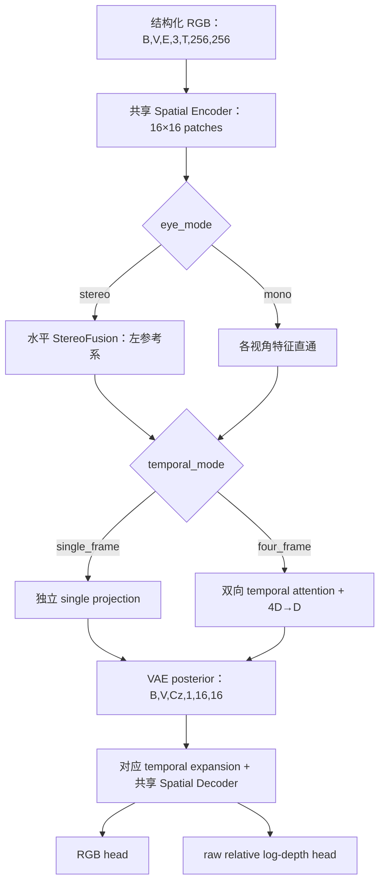

# Stereo Tokenizer Plan

> 更新日期：2026-09-05。实现基线：`hezhou-las2-h`，commit
> `22ffb8f44da201b3fedc13688960c537dd127519`。
> 本文按当前源码重写，替代原 disparity-head、固定六路输入、single/four 交替和离线 GT 先行的旧计划。
> “已实现”表示代码已有该能力；实验状态仅引用带日期的仓库记录，本次没有连接服务器核实作业进度。

## 1. 目标与当前阶段

StereoVAE 从零训练一个同时支持单目/双目、单帧/四帧的视觉 VAE，将每个视角压缩成一个 temporal latent slot，重建参考眼 RGB，并学习统一的 relative log-depth 表征。Tokenizer 不实现跨视角世界模型或动作预测。

当前重点已从搭建网络转向三件事：完成同合同消融、用统一评测量化质量与效率、冻结可供下游使用的 checkpoint 与 latent 合同。Quality、Rate、Training/Inference Speed 并列报告，不能只凭重建图判断模型优劣。

| 工作项 | 当前实现/证据 | 下一步 |
| --- | --- | --- |
| 四模式模型与三源训练 | 已实现；有历史多卡 smoke 记录 | 按正式实验合同验收完整训练与恢复 |
| 三视角/两视角 mono 联合输入 | 已实现，保留独立 view 轴 | 各数据源、各模式分别出分数 |
| Z24/Z48/Z96 latent 消融 | 已实现串行训练入口；9 月 4 日记录 v16 启动 | 验收三组完整结果，形成质量—容量—速度比较 |
| S48/M48/D48 输入消融 | 已实现输入变换；9 月 4 日记录 M48 启动、D48 串行排队 | 补齐同合同 S48 后才给出因果结论 |
| Stage A 本体评测 | selection/preflight/run/benchmark/report 已实现 | 完成新时间指标的运行时验证与正式评测 |
| single-frame rFID | 标准保留，尚无正式实现与运行证据 | 单独冻结实现后补齐 |
| Gate B/C 下游评测 | 统一标准已有定义，不属于本仓库已完成能力 | 冻结下游仓库、数据、模型和资源后执行 |

## 2. 模型合同

### 2.1 输入、输出与边界

模型主类为 `stereo_tokenizer.model.StereoVAE`，公共导入为 `from stereo_tokenizer import StereoVAE`。
输入必须显式传入 `eye_mode` 与 `temporal_mode`，张量为 `[B,V,E,3,T,256,256]`。

| 路径 | V | E | T | 处理方式 |
| --- | ---: | ---: | --- | --- |
| Hy mono | 3 | 1 | 1 或 4 | high、left wrist、right wrist 同一窗口联合输入 |
| LIBERO mono | 2 | 1 | 1 或 4 | agentview、wrist 同一窗口联合输入 |
| UMI stereo | 3 | 2 | 1 或 4 | head、left wrist、right wrist 三组校正双目 |
| 模型通用 mono 接口 | 1–3 | 1 | 1 或 4 | 跳过 StereoFusion |

联合输入是共享权重、合并 batch 计算；模型没有跨 view attention。Stereo 接口仍严格要求 `V=3,E=2`。调用方不得通过复制帧、静默缺眼回退或猜测 shape 改变模式语义。

输出合同：

- raw latent：`[B,V,Cz,1,16,16]`，`Cz ∈ {24,48,96}`，默认 48。
- RGB：`[B,V,3,T,256,256]`；stereo 重建左参考眼，mono 重建各输入视角。
- 几何：`raw_relative_log_depth [B,V,1,T,256,256]`。
- 训练默认从 posterior 采样；确定性评估使用 posterior mean。
- 不对 raw latent 隐式施加下游 normalization；下游 patchify、视角拼接、latent 统计归一化均须另行冻结。

模型不再输出 student disparity，也不把几何 head 的输出称为 metric depth。教师 disparity 与标定用于构建监督，不代表学生恢复了绝对尺度。

### 2.2 编解码结构

当前统一 launcher 的结构参数如下；手写 CLI 或历史 checkpoint 以自身 resolved config 为准。

| 参数 | 当前 launcher |
| --- | --- |
| 分辨率 / spatial patch / latent grid | 256×256 / 16×16 / 16×16 |
| embedding dimension | 512 |
| spatial encoder / decoder | 深度均为 4；`ttww` / `tttt` |
| window / position | 8×8 token window / RoPE |
| temporal encoder / decoder | 深度均为 4，四帧双向 attention |
| attention | 8 heads，head dimension 64 |
| spatial PEG | `causal_in_peg`，`conv2d_t1_slice` |
| StereoFusion 搜索 | 每视角半径 `(7,7,7)`，向右图负 x 方向搜索 |

`single_frame` 使用独立 projection/expansion，跳过四帧 temporal attention；`four_frame` 先做帧间 attention，再以 `4D→D` 压成一个 slot，解码以 `D→4D` 展开。Spatial Decoder 按帧处理，PEG 只看到 `T=1`，四帧信息交换由 temporal 模块承担。

StereoFusion 在同一 view/time/row 上用左特征作 query、右特征作 key/value，屏蔽越界候选。融合为 `left + alpha * confidence.detach() * delta`，其中 confidence 来自 attention entropy，`alpha` 零初始化。右眼没有绕过 latent 的 decoder skip connection。

## 3. 数据与监督

### 3.1 数据生产合同

三源训练复用 `pretrain_data.py`、`lerobot_data.py` 与 `mode_sampling.py` 的现有路径，manifest 保存样本身份与 split，运行时以 node-local alias 解析数据根。

- Hy：当前三相机 manifest 合同为 `hy-mono-three-camera-episode-v2`；旧 high-only manifest 不能作为联合三视角输入。
- LIBERO：同一窗口的 agentview 与 wrist 联合读取。
- UMI：三组左右目必须同步、完成 rectification，并提供与 resize/letterbox 一致的标定和有效内容 mask。
- single/four 是显式模式，由数据路径提供匹配的帧数；不再按奇偶 update 从统一四帧 cache 交替裁切。
- scene window 是 batch 与 logical sample 的统计单位，不能把三个 view 当成三个训练 samples。
- split 按 episode 身份冻结，记录 manifest SHA256、窗口/帧选择、预处理、校正审计及被排除样本，防止训练与评测泄漏。

坏帧、缺少必需相机、无效窗口或标定问题应在数据合同中显式处理；不能用黑图或复制另一只眼静默补齐。已有 canonical UMI manifest 工具不等于所有 canonical 数据都已验收。

### 3.2 在线教师与 relative log-depth

生产 launcher 默认 stereo teacher 为 LAS2-H，mono teacher 为 DA3。`online_gt.py` 仍有 FoundationStereo/PyTorch/TensorRT backend 支持；它们是显式选择的教师路径，不能在同一对照中未经记录互换。

| 来源 | 在线监督 | 统一目标 |
| --- | --- | --- |
| Hy/LIBERO | DA3 positive relative depth | `log(depth)` 后中心化 |
| UMI | LAS2-H disparity，双向推理与 LR consistency mask | `log(fx * baseline / disparity)` 后中心化 |

中心化按每个 sample 执行：先计算各有效 view 在时间和空间上的有效像素均值，再对有监督的 view 等权求中心；预测使用同一 mask 规则去中心。当前实现允许部分 view 没有几何监督，但每个 sample 至少须有一个有效监督 view，否则立即失败。必须报告 valid coverage 与有效样本数。

launcher 当前使用 disparity 有效范围 `[0.5,112]` px、LR threshold `max(1 px,0.05*d)`，LAS2-H 默认 4 iterations；这些是现有 recipe 参数，不是可直接套用到新相机的普适常数。DA3 使用 finite、positive、non-padding mask。

教师在 callback 中生成监督，不进入 student 推理。增量 GT cache 可选，当前消融关闭；启用后只能复用 teacher/source/weights/preprocessing/mask/frame 合同完全一致的缓存。

## 4. 训练与恢复

### 4.1 四模式采样和预算

四种模式按确定性 logical generator-update schedule 选择，同一 gradient accumulation window 保持模式一致。当前 launcher 默认如下：

| mode（参数顺序） | update 权重 | 每卡 batch | GA | 8 卡 effective batch |
| --- | ---: | ---: | ---: | ---: |
| mono/single_frame | 35 | 192 | 1 | 1536 |
| mono/four_frame | 35 | 40 | 1 | 320 |
| stereo/single_frame | 15 | 160 | 1 | 1280 |
| stereo/four_frame | 15 | 36 | 1 | 288 |

mono 来源权重为 Hy:LIBERO=`9:1`。当前允许各模式 effective batch 不同，因此 update 占比不等于 sample 占比。正式比较同时固定 schedule、per-mode batch/GA、样本顺序与直接计数，不能只对齐 `max_steps`。

该组合来自 H200 实验记录，不构成其他 GPU 的容量保证。8 卡、40,000 updates、上述权重和 batch 下，计划预算为每模型 **35,392,000 logical samples**；完成验收读取 checkpoint 的实际 per-mode counters。

### 4.2 损失与训练阶段

已有训练项为 RGB reconstruction、relative log-depth、relative spatial-gradient、KL、LPIPS，以及可选 image GAN、video GAN、feature matching。video GAN 仅用于 four-frame。几何损失按有效像素归一化、有效 view 等权归约；LPIPS 按 view/frame 分块处理并保留总体 mean 语义。

当前首轮消融 recipe：RGB/depth/gradient/LPIPS 权重 `1/1/0.1/1`，KL `1e-6`、warmup 100 updates；generator LR/min LR 均为 `1e-4`、optimizer warmup 20 updates；GAN/feature matching 关闭。精度为 BF16，当前 temporal 路径没有保留早期诊断用的强制 FP32，LPIPS 使用普通 forward 保留激活。

历史训练记录中的 Stage A/B/C 分别涉及基础训练、image GAN、video GAN 阶段；它们与评测的 Gate A/B/C 是两套命名。当前 GAN-off 消融不能与历史 GAN-on checkpoint 直接作单变量比较。

### 4.3 恢复与产物

复用现有 checkpoint 入口：`resume_from_checkpoint`、`continuation_checkpoint`、`stage_transition_checkpoint`、`discriminator_expansion_checkpoint`。普通恢复、延长预算与改变 discriminator 结构的语义不能混用，必须通过相应校验。

验收需包含完整 state dict、模型超参、teacher/manifest/config provenance、generator/discriminator/batch counters 和 per-mode samples。恢复训练须保持 logical schedule 位置，输入消融合同不匹配不得 resume；不能用 Lightning 的 `global_step` 单独代表 generator 更新数。

当前消融每 2,000 generator updates validation、每 5,000 updates checkpoint，并保存 `last.ckpt`、`resolved_config.json`、`run_manifest.json`。这些是本轮 recipe，取代旧文档统一的“10 epochs、每 epoch 保存”计划。

## 5. 当前实验计划

### 5.1 Latent channel：Z96 → Z24 → Z48

仅改变 `Cz`，三组均从零训练，同一数据、teacher、随机种子、更新/样本预算、loss 和评测 selection。历史 Z48 只能用于回归参考。

9 月 4 日记录的正式版本为 **v16**，训练 SHA `f3fba13f5e0585885209dc27539dcf2b3f6600a2`，H200-2、8 卡，顺序 Z96→Z24→Z48，每组 40k updates。记录中 Z96 健康检查覆盖四模式；这不代表三组已经完成。早期 BS384、temporal FP32、LPIPS checkpoint 等失败或测速版本不作为正式三组结果混入。

交付每组的最终 checkpoint、实际 samples、Stage A scorecard、encoder/decode 延迟、显存与训练 samples/s。相同 grid/dtype 下，Z24 和 Z96 的 latent 标量数分别是 Z48 的 0.5 倍与 2 倍；这只说明表示容量，不能等同于端到端速度或编码文件码率。

### 5.2 输入因果对照：S48 / M48 / D48

| 实验 | UMI student 输入 | StereoFusion | 要回答的问题 |
| --- | --- | --- | --- |
| S48-correct | `(L,R)` | 执行 | 正确双目基线 |
| M48-left-only | `L`，三视角 `E=1` | 跳过 | 单目学生在相同监督下的表现 |
| D48-same-left-trained | `(L,L)` | 执行 | 双路结构本身的贡献 |

三者的 UMI teacher 必须先读取真实 `(L,R)` 生成相同监督，之后才改变 student 输入。Hy/LIBERO 路径保持一致。S 对 D 主要检验真实右眼信息收益，D 对 M 帮助区分双路结构影响；S 对 M 给出整体差异。

9 月 4 日记录的 H200-1 **v3** 使用 SHA `7372ab97097ab97827e7054bd86d9173e9f4f2df`，M48→D48 串行、每组 40k updates，batch 与第 4 节一致。已有记录只证明 M48 开始更新，D48 待前者正常结束。**正式因果结论仍需补训本轮同合同 S48**；历史 update-44k 或 H200-2 不同 manifest 的 Z48 都不能替代。

推理时对 S48 做 SameRGB 干预与 D48 从零训练是不同实验；如纳入报告，必须分别标注，不沿用旧计划中容易混淆的 A/B/C 缩写。

### 5.3 Loss 消融与后续架构选择

loss 消融保留为后续工作：以同合同基线逐项检查几何监督、LPIPS/GAN 对 RGB、几何和 latent 下游可用性的影响。具体去除项、是否重训、预算和验收阈值尚未冻结，不在本计划中宣称已启动。

先完成 latent 与输入对照，再依据量化结果决定是否调整 fusion、decoder 或引入新结构。任何新结构需建立单变量实验，避免同时改变数据、容量、损失和 GAN 阶段后归因。

## 6. 评测与验收

### 6.1 Gate A：Tokenizer 本体

使用 `python -m evaluation.tokenizer_stage_a` 的 `selection → preflight → run/benchmark → report` 流程。指标定义以[统一评测标准](Stereo%20Tokenizer统一评测标准.md)为准，冻结 checkpoint SHA256、数据身份、preprocessing、teacher/RAFT 资产、精度、seed、posterior 模式与输出版本。

| 维度 | 当前指标/实施边界 |
| --- | --- |
| RGB | L1、PSNR、SSIM、LPIPS；明确 raw/clamped 和 content crop 口径 |
| 四帧时间质量 | temporal-delta L1/LPIPS、flow warp、static flicker、motion consistency；总体与 01/12/23 相邻帧分别报告 |
| 几何 | teacher-relative log-L1/RMSE/SILog、temporal geometry consistency、coverage 与有效样本数 |
| Rate | latent shape、元素/字节数、时间压缩率，说明输入视角数与 dtype |
| Speed | encoder、decoder、端到端延迟 p50/p95，吞吐、显存；训练另报 samples/s 和 GPU-hours |
| 待补齐 | single-frame rFID 的冻结实现及正式运行 |

mono 评测的 DA3 几何口径为原图与重建图的 teacher 对照；stereo 使用 LAS2-H target 与 student geometry head，不得把两者统一解释为真实深度准确率。

新增 RAFT 时间指标已有代码，但 9 月 4 日记录仍缺正式 PyTorch/GPU 验证。先通过对应合成测试和真实数据 preflight，再对所有候选使用同一新版本重跑；旧报告不能补列为空后称已完成新标准。

Hy selection 复用 production manifest/Lance reader，显式记录 Table014 排除和剩余 table 覆盖，排除后 identity join 缺失应失败。不同 selection 或不同排除范围的分数不能直接比较。

当前不纳入原生四帧 rFVD/FVMD、真实 GT disparity EPE/D1/depth accuracy、右眼重建一致性和缺少标注的语义区域拆分。不要复制/插值扩帧去凑视频指标输入。teacher-relative 指标只能说明与教师的一致性。

### 6.2 Gate B/C：下游验收

Gate B 冻结 Tokenizer，在相同数据、latent 使用合同、下游容量和训练预算下比较轻量 WAM 的未来状态与动作预测；Gate C 沿用正式 WAM checkpoint，做 RoboTwin 完整任务闭环 rollout。

两阶段按统一标准冻结目标仓库完整 SHA、真实实例化模型大小、horizon、action/replan 合同、rollout 数与随机种子。当前仓库的 Stage A 完成不等于 Gate B/C 完成；若实际目标环境只有 LIBERO，需先确定与 RoboTwin 标准的范围关系。

### 6.3 完成门槛

1. 训练完整退出，checkpoint 可严格加载，loss/参数有限，实际 per-mode updates/samples 达到约定预算，配置与数据/teacher 哈希齐全。
2. 消融仅有预期差异；同一 selection 下覆盖所有数据源和模式，记录坏样本、排除和指标 coverage。
3. 本体 scorecard 同时交付质量、表示容量、训练/推理效率；几何结论保持 teacher-relative 边界。
4. 不预设尚未确认的 L1、百分比收益或速度阈值。数值验收阈值须在正式比较前冻结，不能观察结果后选择。
5. 下游结果独立验收；只有相应 Gate 实际完成后，才声明具备对应下游收益证据。

## 7. 执行顺序与交付物

| 优先级 | 工作 | 交付物 |
| --- | --- | --- |
| P0 | 在获准检查时确认现有消融进度、失败原因、最终 checkpoint 与直接 counters | 三组 latent、M/D 的完整状态表；缺失项明确列出 |
| P1 | 完成 Stage A 新时间指标的运行时门禁，冻结共同 selection | 可复现 preflight 与版本一致的质量/性能报告 |
| P1 | 补齐同合同 S48，并完成 S/M/D 比较 | 真实双目信息与结构贡献结论 |
| P2 | 冻结 loss 消融、补齐 single-frame rFID | 独立受控实验与完整本体 scorecard |
| P2 | 选择 checkpoint，冻结下游代码、ABI 与预算，执行 Gate B/C | 离线 WAM 与闭环任务报告 |

本次更新只重写计划，不启动或调整服务器任务，不生成数据、下载资产或提交代码。每次正式实验沿用仓库的运行记录要求；服务器绝对路径、tmux、launch hash 与详细异常保留在对应日期记录中。

## 8. 实现与记录索引

- [模型与训练输入](../stereo_tokenizer/model.py)、[Encoder](../stereo_tokenizer/modules/stereo_encoder.py)、[Decoder](../stereo_tokenizer/modules/stereo_decoder.py)、[StereoFusion](../stereo_tokenizer/modules/stereo_fusion.py)。
- [relative-depth 语义](../stereo_tokenizer/modules/relative_depth.py)、[损失归约](../stereo_tokenizer/modules/stereo_losses.py)、[在线教师](../stereo_tokenizer/online_gt.py)。
- [三源 DataLoader](../stereo_tokenizer/pretrain_data.py)、[四模式采样](../stereo_tokenizer/mode_sampling.py)、[当前 launcher](../scripts/stereo/train_stereo_vae.sh)、[checkpoint 管理](../stereo_tokenizer/training/checkpoints.py)。
- [Stage A 入口](../evaluation/tokenizer_stage_a.py)、[指标实现](../evaluation/stage_a/metrics.py)、[统一评测标准](Stereo%20Tokenizer统一评测标准.md)。
- [mono 联合视角与历史 smoke](../docs/26-09-03/26-09-03-mono-joint-view-training.md)。
- [latent 消融各版本与 v16 启动记录](../docs/26-09-04/26-09-04-latent-channel-ablation.md)。
- [单双目消融与 v3 启动记录](../docs/26-09-04/26-09-04-stereo-input-ablation.md)。
- [Stage A 指标裁剪](../docs/26-09-04/26-09-04-stage-a-metric-pruning.md)、[时间指标与 Hy 路径](../docs/26-09-04/26-09-04-stage-a-temporal-metrics-and-hy.md)。

若历史 README 或实验早期章节与本基线冲突，应回到当前源码及该实验最后一次明确生效的合同核对；例如旧版“mono 单视角”“各模式 batch 必须相等”和早期 LPIPS/FP32 诊断配置均不作为本计划的现行配置。
