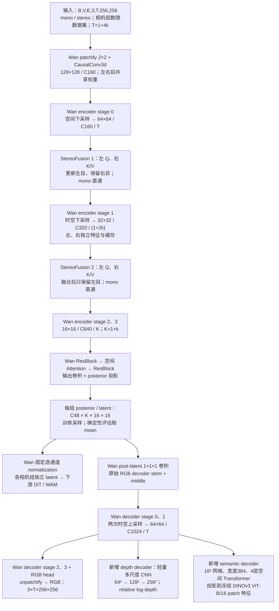

# Stereo Tokenizer V2：从 Wan2.2 VAE 初始化



> 确认日期：2026-09-10。状态：暂定最终架构计划，尚未实现或训练验证。
> 本版替代旧 V2 的自定义 CNN/Transformer、四帧拼接压缩、C96 和自定义 RGB decoder。V1 现状仍由 [V1 计划](Stereo%20Tokenizer%20Plan.md)描述，不能将本计划视为已经实现的能力。
> 本次仅更新设计文档；训练资源、正式超参数和数值验收阈值在实施前单独冻结。

## 1. 已确认的设计边界

| 项目 | 本版定义 |
| --- | --- |
| 初始化 | Wan2.2 TI2V-5B 对应的 Wan2.2 VAE checkpoint；只复用 tokenizer，不加载扩散主干或文本编码器 |
| 原始骨干 | 保留 Wan encoder、posterior 投影、post-latent 投影及完整 RGB decoder 的层数、宽度、卷积、残差和上下采样结构 |
| 新增结构 | 两处 V1 式 StereoFusion，以及 depth、semantic 两个 decoder 分支 |
| 输入 | 保留 V1 的单目/双目、相机身份、左右目、预处理和标定语义；相机组数随数据集变化 |
| 时间 | 统一 `T=1+4k`、`K=1+k`，含 T=1；首版视频窗口采用 T=17，不沿用 V1 的 T=4 专用结构 |
| 空间与 latent | 首版 256×256；每个相机组输出 `[B,48,K,16,16]` |
| 双目输出 | 左目参考系；第一次融合后保留右目，第二次融合后丢弃右目后续计算 |
| 跨相机组 | 共享网络权重，分别编码；tokenizer 不新增跨相机组 attention，交互交给下游 |
| RGB | 保留完整 Wan RGB decoder，重建所有有效参考眼帧 |
| 深度 | 沿用 V1 relative log-depth 目标、中心化、mask 与空间梯度损失 |
| 语义 | 冻结 DINOv3 ViT-B/16，自然图像预训练模型；最终层 patch 特征监督全部有效参考眼帧 |
| 训练 | 原始基线验证 → 仅训练新增模块 → 先解冻 decoder、再解冻 encoder；旧模块小学习率、新模块大学习率 |

“保留 Wan 网络”包括具体算子、padding、patch 通道排列、首帧处理和时序缓存语义。仅让 latent 维度相同，不能实现 checkpoint 等价复用。模型名称中的 5B 是生成模型规格，不是 VAE 参数量。

## 2. 输入、数据与输出合同

### 2.1 单目、双目与可变相机组数

沿用 V1 张量轴约定：`X ∈ R[B,V,E,3,T,256,256]`，其中 V 为有效相机组数，mono 的 E=1，stereo 的 E=2。不同数据源允许不同 V；首版按来源和模式组织同形 batch，不要求把所有来源补成固定三组双目，也不引入逐组混合单双目的新数据格式。

| 数据路径 | 相机组 | 眼数 | V2 时间接口 |
| --- | --- | --- | --- |
| Hy mono | 现有三相机 | 1 | T=1 或 1+4k 视频窗口 |
| LIBERO mono | 现有两个相机 | 1 | T=1 或 1+4k 视频窗口 |
| UMI stereo | head、left wrist、right wrist 三组 | 2 | T=1 或 1+4k 视频窗口 |

相机组身份和左右眼语义保持固定。网络参数在相机组、眼和时间之间共享，但特征、样本状态及缓存独立。每个 scene window 仍计为一个 logical sample，不能把 V 个相机组算成 V 个训练样本。

mono 在两处融合位置均直接通过；stereo 必须提供真实、同步、校正后的左右目，缺眼不得静默退化为 mono。继续保留帧/相机/有效内容 mask、时间戳及几何监督所需标定。不同 V 的支持不代表允许忽略数据源规定的必需相机。

原有 split、视角顺序、裁剪/letterbox 和标定更新规则保持一致；视频窗口 reader 需要适配新的 `1+4k`，旧 T=4 manifest 或 cache 不能直接宣称兼容。采样间隔与窗口时长另行记录，不能用复制帧凑长度。mask 只控制有效监督，不自动赋予原始 Wan encoder 忽略坏帧的能力；有效编码窗口必须满足数据合同。

### 2.2 像素范围与输出

V1 数据张量范围为 `[-0.5,0.5]`；进入 Wan 前显式乘 2，转换到 Wan 的 `[-1,1]`。保持原空间几何预处理，不因为复用权重改变左右目裁剪关系。对接 V1 loss/输出时显式转换回约定范围，LPIPS 和 DINO 分别使用其要求的预处理，避免重复缩放。

每个样本输出：

- raw posterior mean/logvar：`[B,V,48,K,16,16]`，raw latent 同形。
- RGB：`[B,V,3,T,256,256]`；双目只重建左眼，单目重建各输入相机。
- raw relative log-depth：`[B,V,1,T,256,256]`，按 V1 规则中心化后用于监督。
- semantic patch features：`[B,V,D_teacher,T,16,16]`，DINOv3 ViT-B/16 的特征宽度为 768。

## 3. Wan encoder：按数据流保留原始模块

基础实现固定参考 Wan 官方 `wan/modules/vae2_2.py`，源码 revision 为 `42bf4cfaa384bc21833865abc2f9e6c0e67233dc`。采用 Wan2.2 VAE 包装器对应参数：encoder base width 160、decoder base width 256、z_dim 48、dim_mult `[1,2,4,4]`、encoder temporal downsample `[False,True,True]`。不能误用底层类的其他默认值或 Wan2.1 的 16 通道 VAE。

下表为 T=17 时每个有效眼/参考眼的特征；时间长度是所有原生 chunk 拼接后的长度。

| 顺序 | 模块 | C | T | H×W | 处理眼数 |
| --- | --- | ---: | ---: | --- | --- |
| 1 | 原始 2×2 patchify | 12 | 17 | 128×128 | 左右/mono |
| 2 | encoder stem CausalConv3d | 160 | 17 | 128×128 | 左右/mono |
| 3 | encoder stage 0：残差块 + 空间下采样 | 160 | 17 | 64×64 | 左右/mono |
| 4 | 新增 StereoFusion 1 | 160 | 17 | 64×64 | 更新左，右保留 |
| 5 | encoder stage 1：残差块 + 时空下采样 | 320 | 9 | 32×32 | 左右/mono |
| 6 | 新增 StereoFusion 2 | 320 | 9 | 32×32 | 此后只留左/mono |
| 7 | encoder stage 2：残差块 + 时空下采样 | 640 | 5 | 16×16 | 参考眼 |
| 8 | encoder stage 3：残差块，不再下采样 | 640 | 5 | 16×16 | 参考眼 |
| 9 | middle：ResBlock → AttentionBlock → ResBlock | 640 | 5 | 16×16 | 参考眼 |
| 10 | RMS norm → SiLU → 输出 CausalConv3d | 96 | 5 | 16×16 | posterior 特征 |
| 11 | 原始 1×1×1 posterior 投影，拆为 mean/logvar | 各 48 | 5 | 16×16 | 每组独立 posterior |

每个 encoder stage 保留原始两层 ResidualBlock 配置及相应下采样结构。ResidualBlock 使用 RMS norm、SiLU、因果 3D 卷积及残差捷径；Down_ResidualBlock 的原始平均下采样残差路径也保留。middle 的 AttentionBlock 对各时间位置做空间 attention；时间依赖主要由因果卷积及缓存承载，不替换成 V1 的 temporal Transformer。

patchify 必须保留官方空间到通道的具体排列，不能只凭输出 C12 就替换成另一种排列的算子。

## 4. 两阶段 StereoFusion

### 4.1 复用 V1 机制

沿用 [V1 StereoFusion](../stereo_tokenizer/modules/stereo_fusion.py)：同一相机组、同一特征时间位置、同一行内，左特征提供 Query，右特征提供 Key/Value；沿右图负 x 方向局部搜索，屏蔽越界候选。融合为：

```text
left_out = left_in + alpha × stopgrad(confidence) × delta
```

confidence 来自 attention entropy，alpha 零初始化。两处 fusion 各自拥有参数和 alpha，分别适配 C160/C320；同一处的网络参数跨相机组共享。继承 V1 的匹配和门控思想，不复制旧 C512 投影形状，也不增加双向融合、STTR 或额外匹配监督。

搜索半径以当前层特征像素为单位。V1 在 16×16 网格上的半径不能直接在 64×64、32×32 上照抄并声称搜索范围相同；实现时必须依据输入像素视差范围、各层缩放和视角标定冻结半径。attention 分头数也需与 C160/C320 对齐。这些属于实施配方，不改变两处融合的结构决定。

### 4.2 右目保留到哪里

第一次融合只更新左目，右目仍是自己的原始分支特征。随后两路分别通过共享权重的 encoder stage 1；第二次融合使用更新后的左目及对应时间尺度的右目。第二次融合输出后，仅左目进入 stage 2、3、posterior 和 decoder。

因此右目只运行到第二处 fusion 的输入位置，不计算右目 posterior 或右目 decoder。两处 alpha 为零时，左目原始 Wan 路径应与独立编码同一左目一致；这需要数值回归验收，不能仅凭初始化公式宣称已验证。

第二处特征已有一次时间压缩，其同一行匹配是对压缩后时空特征的融合，不应描述成原始单帧视差估计。跨帧运动、遮挡和时间压缩对对应关系的影响需在消融中检查。

### 4.3 缓存与因果性

左右目共享权重但不能共享缓存；不同相机组、不同样本也不能串用缓存。每个 chunk 在同一层完成左右融合后，再继续左目下游计算。右目在前两级的历史缓存须保留到整个视频窗口完成，不能在每个 chunk 的第二次融合后清掉其后续 chunk 仍需要的历史。

fusion 仅访问同一特征时间位置的左右流，不引入未来时间 attention。保留原始 Wan 首帧和后续四帧 chunk 的调度。禁止无依据 detach 跨 chunk 的训练图；冻结参数与截断输入梯度是两回事。

## 5. Posterior、latent 与时间合同

原始 posterior 投影输出 96 通道，拆分得到 48 通道 mean 和 logvar。训练可在 raw posterior 空间重参数化采样；确定性验证和下游编码使用 mean。官方推理 encode 的 mean 路径不等于完整 VAE 训练入口，训练实现需要显式暴露 posterior，保持原权重结构不变。

原生编码时间关系为 `T=1+4k → K=1+k`：首帧独立，后续每四帧产生一个 latent 时间位置；解码恢复 T 帧。不再使用旧 V2 的四槽 padding、四帧拼接 Linear、跨 latent 自定义 temporal attention 或末帧残差。

保留 Wan checkpoint 对应的 48 通道固定 mean/std：`z_norm=(z_raw-mean)/std`，解码前反变换。KL 在 raw posterior 坐标中计算。图中 raw latent 可以直接走内部 decoder；若使用官方接收 normalized latent 的包装器，则必须按其接口先归一化，并由包装器反变换，不能漏变换或重复变换。

先固定原始 normalization 作为接口；联合训练后监测 posterior 与归一化 latent 分布漂移，不静默重新估计统计量。C48 和 shape 相同不保证继续兼容原始 Wan 扩散主干的 latent 分布。

## 6. 完整 Wan RGB decoder 与两个辅助分支

### 6.1 RGB 路径完全保留

| 顺序 | 模块 | C | T（输入17帧） | H×W |
| --- | --- | ---: | ---: | --- |
| 1 | post-latent 1×1×1 卷积 | 48 | 5 | 16×16 |
| 2 | decoder stem + ResBlock/Attention/ResBlock middle | 1024 | 5 | 16×16 |
| 3 | decoder stage 0：残差块 + 时空上采样 | 1024 | 9 | 32×32 |
| 4 | decoder stage 1：残差块 + 时空上采样；辅助分支接点 | 1024 | 17 | 64×64 |
| 5 | decoder stage 2：残差块 + 空间上采样 | 512 | 17 | 128×128 |
| 6 | decoder stage 3：残差块，无上采样 | 256 | 17 | 128×128 |
| 7 | RMS norm → SiLU → 原始 RGB 输出卷积 | 12 | 17 | 128×128 |
| 8 | 原始 2×2 unpatchify | 3 | 17 | 256×256 |

每个 decoder stage 保留原始三层 ResidualBlock 配置和 Up_ResidualBlock 中的上采样残差路径。不得为了旧 V2 参数预算缩窄 decoder，也不将输出卷积扩成 RGB+depth 联合输出；两个新 head 独立接出，原 RGB 权重形状保持不变。

官方推理包装器的输出 clamp 与训练损失路径需区分：训练对未 clamp 的 RGB 计算重建损失，验证明确 raw/clamped 口径，不让推理 clamp 静默截断训练梯度。

### 6.2 共享分支入口

两个新增 decoder 均从 `decoder.upsamples[1]` 的输出，即 `[B,V,1024,T,64,64]` 接出。此处已完成两次时间上采样，因此辅助头逐帧做空间解码，不再各自实现时间展开。分块运行时将对应分支输出按原时间顺序组合。

所有预测均经过最终 latent；不接 encoder skip、原始右图、教师特征或额外 reference 图像。几何与语义 loss 会反传到共享 RGB decoder 前段和 encoder；这正是共同监督瓶颈的路径。

### 6.3 Depth decoder：沿用旧 V2 的轻量 CNN 多尺度结构

从共享 64×64 特征经独立通道投影进入较轻 CNN，在 64×64 提取特征，再逐级上采样至 128×128、256×256，输出单通道 raw relative log-depth。各层参数在帧和相机组间共享，空间边界由 CNN 上采样与细化恢复。

保留原计划的结构类型，不复制整套 Wan decoder，不加入独立 temporal decoder。旧计划没有冻结此分支各层通道/残差块数；这些数值在实施配置中依据容量、梯度与性能检查确定，不将旧计划估计的 10M–18M 当作硬约束或真实参数量。

### 6.4 Semantic decoder：沿用旧 V2 的浅层 Transformer

共享 64×64 特征先通过空间降采样/网格对齐和输入投影形成 16×16、宽度 384 的逐帧特征，再经过 4 个空间 Transformer block、二维位置信息及输出投影，得到 DINO 特征宽度 768。保留旧计划 FFN expansion ratio 4，不在 64×64 的 4096 个位置直接运行旧计划的全局 attention。

16×16 网格对应教师 patch 网格；降采样应保持相同裁剪坐标，不将不同图像区域按数组下标硬对齐。该分支没有跨相机、跨时间 attention。4 层 Transformer 主体约 7.08M 参数是旧计划的理论估算，不含输入输出投影、位置参数等，最终以实例化统计为准。

教师固定为自然图像预训练的 DINOv3 ViT-B/16，eval 且冻结。提取最终层归一化 patch tokens，排除 CLS/register tokens。使用所有有效参考眼帧；教师接收原始目标图像，经与学生目标区域一致的裁剪及 DINO 专用 normalization，不接收学生重建图。教师权重文件、revision 和哈希在训练前登记。

## 7. 监督与归约

```text
L = λ_rgb L_rgb + λ_lpips L_lpips
  + λ_depth L_relative_log_depth + λ_grad L_relative_gradient
  + λ_sem L_semantic + β L_KL
```

### 7.1 RGB 与相对深度

RGB 重建和 LPIPS 沿用 V1 的目标眼、有效区域及归约约定，并显式处理像素范围变化。相对深度沿用 [V1 relative_depth.py](../stereo_tokenizer/modules/relative_depth.py) 和 [损失实现](../stereo_tokenizer/modules/stereo_losses.py)：

1. mono 使用 V1 的 DA3 positive depth，取 log；stereo 使用 V1 的 LAS2-H disparity 及标定，得到 `log(fx × baseline / disparity)`。教师 backend 不在本版擅自更换。
2. 对每个样本的每个有效 view，先在有效时间/空间像素上求 log-depth 均值，再对有监督的 view 等权平均，得到一个共同 sample center。
3. 所有 view 减去该共同 center；预测按相同有效 mask 规则独立计算其 center。保留跨视角相对关系，不改成逐 view、逐帧或中位数归一化。
4. 使用 V1 masked SmoothL1 及 relative spatial-gradient 损失；按有效像素、有效 view 和 sample 约定归约。一个样本可以部分 view 无深度监督，但不能全部无有效深度。

继续沿用 finite/positive/content mask、双目 LR consistency 及与 resize/letterbox 一致的标定。几何结果称为 teacher-relative，不能称为学生 metric depth 或真实 GT 精度。教师仅生成训练目标，不进入 student 推理。

### 7.2 语义与 KL

语义对有效目标 patch 计算 `1-cos(student, stopgrad(teacher))`；每个 sample 内先按有效 frame/patch 归约、再对有效 view 等权，最后对 batch 求均值。padding 对应 patch 不作为有效监督；patch 有效区域判定须与数据预处理共同记录，教师在 padding 邻域的上下文影响也需通过验证检查。

KL 约束 raw posterior；fusion 开始训练时，即使原始 encoder 参数冻结，posterior 仍可能随融合变化，因此 KL 也可约束新增融合产生的分布漂移。权重必须按新的 C48、K、V 和归约口径校准，不能直接照搬 V1 的数值。重建、几何、语义权重同样需记录归一化与共享特征梯度贡献。

首版新增模块适应阶段不加入 GAN；完整联合训练是否增加 image/video GAN 留作独立配方与消融，不作为已确认架构的必要组成。本文不声称复现了 Wan 官方完整预训练 loss/数据配方。

## 8. 初始化与分阶段继续训练

### 8.1 原始基线验证

先使用未改网络严格加载对应 Wan2.2 VAE 权重，固定源码 revision、checkpoint SHA256、dtype、输入范围和 normalization。验证 T=1/5/17 的 posterior mean 编解码、空间与时间 shape、首帧和原生 chunk/cache 行为。沿用官方分块语义；不能直接把无 cache 的整段 forward 当作等价参考。

随后接入 fusion 和辅助头。Wan 原始参数必须全部成功加载，missing/unexpected keys 只能来自明确登记的新增模块；采用先严格加载骨干、后挂新增模块，或对骨干严格核验的等价方式，不用宽泛 `strict=False` 掩盖结构差异。alpha=0 时比较 mono、双目左支与原始 mean/RGB 输出。

训练入口需解除推理包装器的冻结/no-grad 假设，并暴露 raw posterior；这些属于调用路径适配，不改变 checkpoint 网络结构。只加载预训练模型权重，不将其误当作已有本项目 optimizer/scheduler/counters 的训练恢复点。

### 8.2 新增模块适应

冻结所有 Wan 原始参数，只训练两处 fusion、depth decoder、semantic decoder，教师始终冻结。保留 RGB/LPIPS、几何、语义及经校准的 KL 约束；用原始 RGB 质量监测新增融合是否破坏预训练表示。

冻结网络参数时仍须保留 fusion 之后共享 encoder/decoder 对输入的梯度。不能将整个冻结网络放入 no_grad，也不能把中间特征 detach 后再训练融合。alpha=0 的第一步可能主要更新门控系数，随后内部投影才获得有效梯度；应检查阶段性的梯度流而非要求所有 fusion 参数首步均非零。

### 8.3 先 decoder、再 encoder 联合解冻

| 阶段 | Wan encoder / posterior | Wan decoder / post-latent 投影 | 新增模块 |
| --- | --- | --- | --- |
| 适应 | 冻结参数 | 冻结参数 | LR_new |
| decoder 联合 | 冻结参数 | 起始 0.1 × LR_new | LR_new |
| 全网联合 | 小学习率；可低于 decoder | 起始 0.1 × LR_new | LR_new |

借鉴 RefDecoder 的分组学习率思想：已有模块以较小步长适应，新加模块以较大学习率学习。0.1 是本项目起始比例，不是对当前数据最优的结论；也不引入 RefDecoder 的 reference 输入路径。

阶段转换依据共同验证集的 RGB 保真、相对几何、语义质量、latent 分布及梯度稳定性，不只依赖固定训练步数。解冻后保留已训练新增模块的 optimizer 状态，明确新解冻参数的 optimizer group 与 scheduler 位置，不无意重置整个训练进度。

## 9. 下游接口、成本与验收

### 9.1 每组 latent 独立交付

每个相机组保留 `[48,K,16,16]` 网格。下游可独立空间 patchify 后沿序列拼接，并传入相机身份、时间信息和有效 token mask；下游具体 DiT/WAM 结构不在本版扩展。

若下游采用空间 2×2 patch、时间不再压缩，则每个 token 输入宽度为 `48×2×2=192`，每组 token 数为 `64K`：

| 输入 T | latent K | 每组 tokens | 两组 | 三组 |
| --- | ---: | ---: | ---: | ---: |
| 1 | 1 | 64 | 128 | 192 |
| 5 | 2 | 128 | 256 | 384 |
| 17 | 5 | 320 | 640 | 960 |

这是下游 patchify 示例，不是新增 tokenizer 模块，也不是已经核验过目标 WAM 的接口。保留 Wan 的固定归一化定义；换用其他 normalization 必须形成新的显式接口版本。

### 9.2 成本与验收顺序

旧 V2 的 150M–200M 总预算失效。骨干容量由原始 Wan checkpoint 决定，再独立统计两处 fusion 和两个辅助头；冻结 DINO/depth 教师单独报告参数、计算与显存。双目额外 encoder 开销仅覆盖第二处 fusion 以前的右分支；实际速度仍须实测。

1. **加载与数值基线**：原骨干权重覆盖率、T=1/5/17、mono/stereo、多 V、alpha=0 回归、缓存隔离、归一化往返。
2. **训练可行性**：新增参数与冻结尾部的梯度流、posterior/损失有限、阶段解冻和恢复语义、直接 per-mode sample/update counters。
3. **本体质量**：RGB/视频质量、深度 teacher-relative 指标、DINO 对齐、固定轻量 latent probe；报告有效监督覆盖，不以更强辅助 decoder 的成绩独自证明 latent 更好。
4. **结构消融**：在相同数据、预算和监督下比较零/一/两处融合，分别核验右目输入的贡献；再独立研究语义和深度 loss。
5. **成本与下游**：encoder/decoder 延迟、吞吐、显存、latent 元素数；冻结 tokenizer 后在同合同 DiT/WAM 和任务评测中验证收益。

数据预处理、来源/单双目比例、T 分布、V、posterior 模式、teacher 身份与样本预算必须随对照记录。V1 的 T=4 与 V2 的 T=17 直接比较包含时间窗口变化，不能归因为单一网络结构变化。

## 10. 实施前仍需冻结的配方

以下是实施与实验数值，暂不改变已确认主架构；本计划不以虚构默认值代替它们：

- Wan 与教师权重的具体资产路径、revision、哈希，原始 baseline 的数值误差容限。
- 两层 fusion 的搜索半径、分头配置；depth CNN 各级宽度/块数与 semantic 输入网格适配算子。
- 视频采样间隔、窗口覆盖时长、T=1/T=17 和各来源/模式采样比例。
- loss/KL 归约与权重、绝对学习率、encoder LR 比例、阶段切换阈值、batch/GA 和训练预算。
- 数据/标定/有效 mask 验收、实际教师成本、下游目标及正式数值验收阈值。

开始实现时优先复用官方 Wan 模块和本仓库现有训练/数据能力，先关闭加载与数值基线，再接入新增结构并分阶段训练；不从头重写一套仅 shape 相似的网络。本次只修改计划，不启动实现、下载 checkpoint 或运行服务器任务。

## 11. 参考与本地实现依据

- [Wan2.2 官方仓库](https://github.com/Wan-Video/Wan2.2)；[本计划固定版本的 VAE 实现](https://github.com/Wan-Video/Wan2.2/blob/42bf4cfaa384bc21833865abc2f9e6c0e67233dc/wan/modules/vae2_2.py)。
- [DINOv3 官方代码与模型](https://github.com/facebookresearch/dinov3)：ViT-B/16 自然图像教师。
- [RefDecoder 论文](https://arxiv.org/abs/2605.15196)：引用旧/新模块差异学习率的继续训练思路；不宣称已复现该训练代码。
- [V1 计划](Stereo%20Tokenizer%20Plan.md)、[StereoFusion](../stereo_tokenizer/modules/stereo_fusion.py)、[relative depth](../stereo_tokenizer/modules/relative_depth.py)、[losses](../stereo_tokenizer/modules/stereo_losses.py)、[online teacher](../stereo_tokenizer/online_gt.py)、[数据入口](../stereo_tokenizer/pretrain_data.py)。
