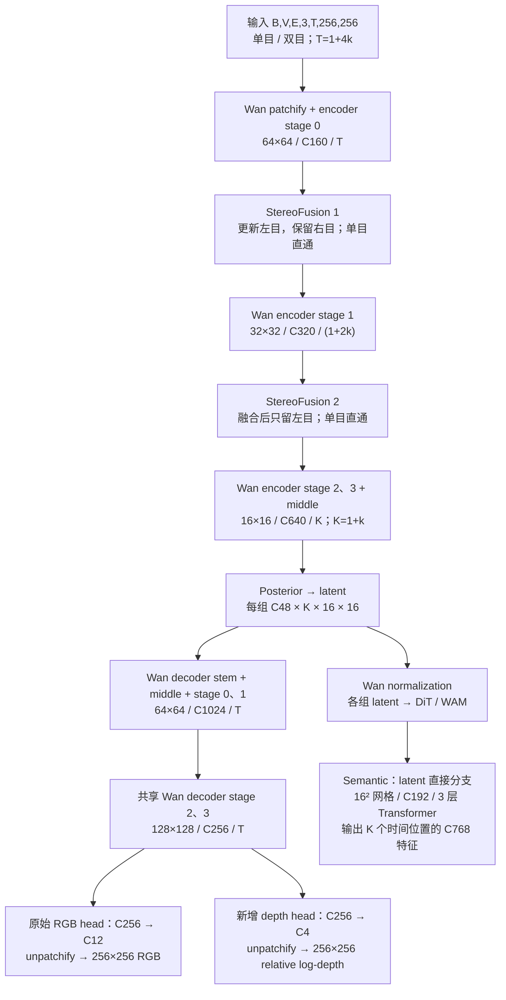

# Stereo Tokenizer V2：从 Wan2.2 VAE 初始化



## 1. 设计思路

从 Wan2.2 TI2V-5B 的 VAE 权重开始训练，保留完整 encoder、posterior 和 RGB decoder，增加两处 V1 式 StereoFusion，以及深度、语义两个辅助头。

RGB 重建保留图像细节，双目融合引入几何信息。Depth 与 RGB 共享完整 Wan decoder，仅末端输出头独立；semantic 从下游使用的归一化 latent 直接接出，通过小型 Transformer 学习容易读出的语义。两条监督路径均经过 latent，无 encoder skip。

当前结构按相机组独立编码、共享权重，跨组交互交给下游 DiT/WAM；视角 merge 的最终位置仍列为待讨论项。

## 2. 输入与 latent

| 要素 | 定义 |
| --- | --- |
| 输入 | `[B,V,E,3,T,256,256]`，像素范围 `[-1,1]` |
| 相机组 | Hy：3 组单目；LIBERO：2 组单目；UMI：3 组双目 |
| 时间 | `T=1+4k → K=1+k`；支持单帧，视频窗口 T=17 对应 K=5 |
| Latent | `[B,V,48,K,16,16]`；训练从 posterior 采样，确定性评估取 mean |
| RGB | `[B,V,3,T,256,256]`，双目重建左眼，单目重建自身 |
| 深度 | `[B,V,1,T,256,256]`，relative log-depth |
| 语义 | `[B,V,768,K,16,16]`；与 T 帧 DINO 目标的时间对应方式待确认 |

沿用 V1 的视角顺序、split、裁剪/letterbox、标定和有效区域 mask，视频 reader 改为 `1+4k` 窗口。双目要求同步、校正和有效左右眼；一个多相机窗口计为一个训练样本。

保留 Wan 的固定逐通道 mean/std：`z_norm=(z_raw-mean)/std`，解码时反变换；KL 在 raw posterior 上计算。

## 3. Wan 骨干

复用官方 [vae2_2.py](https://github.com/Wan-Video/Wan2.2/blob/42bf4cfaa384bc21833865abc2f9e6c0e67233dc/wan/modules/vae2_2.py)。Encoder/decoder 基础宽度为 160/256，latent 为 C48，`dim_mult=[1,2,4,4]`，encoder 时间下采样配置为 `[False,True,True]`。

下表以 17 帧、256×256 输入为例，形状按 `C × T × H × W` 表示。

| Encoder 顺序 | 输出形状 |
| --- | --- |
| 2×2 patchify → CausalConv3d stem | `160 × 17 × 128 × 128` |
| stage 0：残差块 + 空间下采样 → Fusion 1 | `160 × 17 × 64 × 64` |
| stage 1：残差块 + 时空下采样 → Fusion 2 | `320 × 9 × 32 × 32` |
| stage 2：残差块 + 时空下采样 | `640 × 5 × 16 × 16` |
| stage 3 → ResBlock / 空间 Attention / ResBlock | `640 × 5 × 16 × 16` |
| RMS norm → SiLU → 输出卷积 → posterior 投影 | mean/logvar 各 `48 × 5 × 16 × 16` |

| RGB decoder 顺序 | 输出形状 |
| --- | --- |
| post-latent 投影 → stem → ResBlock / Attention / ResBlock | `1024 × 5 × 16 × 16` |
| stage 0：残差块 + 时空上采样 | `1024 × 9 × 32 × 32` |
| stage 1：残差块 + 时空上采样 | `1024 × 17 × 64 × 64` |
| stage 2：残差块 + 空间上采样 | `512 × 17 × 128 × 128` |
| stage 3：RGB / depth 共享特征 | `256 × 17 × 128 × 128` |
| 原始 RGB head：RMS norm → SiLU → 输出卷积 | `12 × 17 × 128 × 128` |
| 2×2 unpatchify | `3 × 17 × 256 × 256` |

保留 encoder 每级 2 个、decoder 每级 3 个残差块，以及原始上下采样残差、patch 排列、因果卷积和首帧缓存逻辑。RGB loss 使用未 clamp 的输出。

## 4. StereoFusion（和V1一致，需要进一步完善设计）

沿用 [V1 StereoFusion](../stereo_tokenizer/modules/stereo_fusion.py)：左目 Q、右目 K/V，在同一特征时刻、同一行内向右图负 x 方向搜索，屏蔽越界位置。

```text
left_out = left_in + alpha × stopgrad(confidence) × delta
```

confidence 来自 attention entropy，alpha 零初始化。两层 fusion 参数独立，分别适配 C160/C320，同层权重跨相机组共享。

第一次融合后，两眼继续通过共享的 stage 1；第二次融合后，仅左目进入后续 encoder 和 decoder。单目跳过两处融合。搜索半径按各层分辨率和标定换算。

左右目、相机组及样本分别维护缓存。右目前两级的缓存保留到窗口结束，供后续 chunk 使用。第二处融合处理已压缩一次时间的特征，其运动与遮挡效果需通过消融判断。

## 5. 辅助 decoder 与监督

### 5.1 相对深度

与 RGB 共享完整 Wan decoder，从最后一级残差特征 `[B,V,256,T,128,128]` 接出独立输出头：

```text
RMSNorm → SiLU → CausalConv3d（3×3×3，256→4）
→ Wan 2×2 unpatchify → [B,V,1,T,256,256]
```

原始 RGB head 及权重保持不变。Depth 输出为无界的 raw relative log-depth，不加 sigmoid 或正值约束；两种损失共同训练共享 decoder。

监督沿用 [V1 relative depth](../stereo_tokenizer/modules/relative_depth.py)：mono 使用 DA3 的 `log(depth)`；stereo 使用 LAS2-H 的 `log(fx × baseline / disparity)`。每个 view 先在有效时间、空间像素上求均值，再对有效 view 等权求共同 sample center；目标和预测分别按此规则去中心。

损失为 masked SmoothL1 + 相对深度空间梯度，保留 V1 的有效区域和双目 LR consistency 规则。输出表示相对深度，评估需区分教师一致性与真实深度精度。

### 5.2 语义

```text
归一化 latent：[B,V,48,K,16,16]
→ 每个相机组、每个时间位置展平为 256 个空间 token
→ Linear 48→192 + 固定二维 sin/cos 位置编码
→ 3 层 Pre-LN Transformer（4 heads，FFN 192→768→192，GELU）
→ LayerNorm + Linear 192→768
→ [B,V,768,K,16,16]
```

语义头独立于 RGB decoder，不做空间缩放、时间展开或跨相机 attention。每个 latent 时间位置分别做空间 self-attention，所有位置和相机组共享参数；时间信息由 Wan encoder 提供。

起始规格为 **3 层、宽度 192、4 heads（每头 48 维）、FFN ratio=4**。按标准带偏置 Linear 和 LayerNorm 计算，Transformer 主体约 1.33M，含输入/输出投影及末端 LayerNorm 共约 **1.49M 参数**；这是结构估算，尚未实例化验证。

当前教师为冻结的 DINOv3 ViT-B/16，自然图像预训练权重。对有效参考眼帧提取最终层 patch 特征，排除 CLS/register tokens；空间裁剪一致，目标按有效 patch 计算 cosine loss，各 view 等权归约。PE 监督保留为后续调研项。

**时间目标待确认：**头输出 K 个时间位置，不能直接沿用 T 帧逐帧监督。建议首帧独立，后续每 4 帧 DINO 特征按对应空间位置做有效帧平均，再归一化为一个目标，T=17 时得到 5 组。该候选监督组平均语义，不恢复组内逐帧变化；确认后再固定聚合与有效 mask 规则。

参考 [MAETok，Table 1d](https://arxiv.org/html/2502.03444v2#S4.SS2) 和 [RecTok，arXiv v2 Table 10](https://arxiv.org/html/2512.13421v2#S4.SS3) 的轻量辅助头设计：前者 3 层优于更深配置，后者小型 Transformer 的表征与生成效果优于大模型。宽度、层数和分头参考 [RecTok tiny 配置](https://github.com/Shi-qingyu/RecTok/blob/ee87aaf015d9f758caa54c2a5df01516dc1e5253/models/model_utils.py)，不照搬其 masking/noise 配方，也不将图像实验结果视为本视频任务的最优规格。

### 5.3 总损失

```text
L = λ_rgb L_rgb + λ_lpips L_lpips
  + λ_depth L_relative_depth + λ_grad L_depth_gradient
  + λ_sem L_semantic + β L_KL + γ L_gan
```

RGB、LPIPS 和几何监督沿用 V1。KL 约束 raw posterior，权重按新的 latent 尺寸校准。新增模块适应阶段关闭 GAN；联合训练是否启用 image/video GAN 另行确定。

## 6. 初始化与训练

先严格加载原始 Wan VAE，验证 T=1/5/17 的编解码、归一化和缓存；加入 fusion 后检查 alpha=0 时左目结果与原始 Wan 一致。

| 阶段 | Encoder / posterior | RGB decoder / post-latent 投影 | Fusion 与辅助头 |
| --- | --- | --- | --- |
| 新模块适应 | 冻结 | 冻结 | LR_new |
| Decoder 联合训练 | 冻结 | 0.1 × LR_new | LR_new |
| 全网联合训练 | 小学习率，可低于 decoder | 0.1 × LR_new | LR_new |

参考 [RefDecoder](https://arxiv.org/abs/2605.15196) 的分组学习率思路，旧模块小学习率、新模块大学习率。冻结参数时仍保留 fusion 后续路径的输入梯度；教师始终冻结。

根据 RGB、几何、语义及 latent 分布的验证结果切换阶段，保留已训练模块的 optimizer 状态。按重建、下游生成、任务成功率三个层次评估，同时记录编码速度和显存。

## 7. 待确定

- 视角 merge 最终放在 tokenizer 还是 DiT；语义监督是否采用 PE。
- Fusion 搜索半径与分头数、K 个 latent 位置与 T 帧语义目标的时间对应方式。
- 视频采样间隔、单双目及单帧/视频比例、loss 权重和阶段切换标准。
- 权重版本与哈希、学习率、batch/GA、训练预算及三层评测的具体指标。
